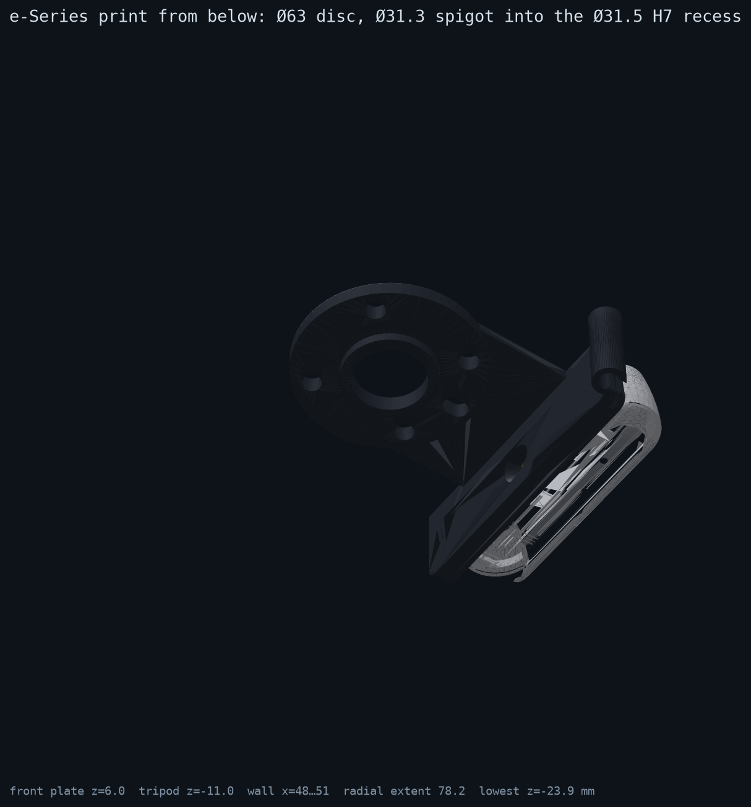
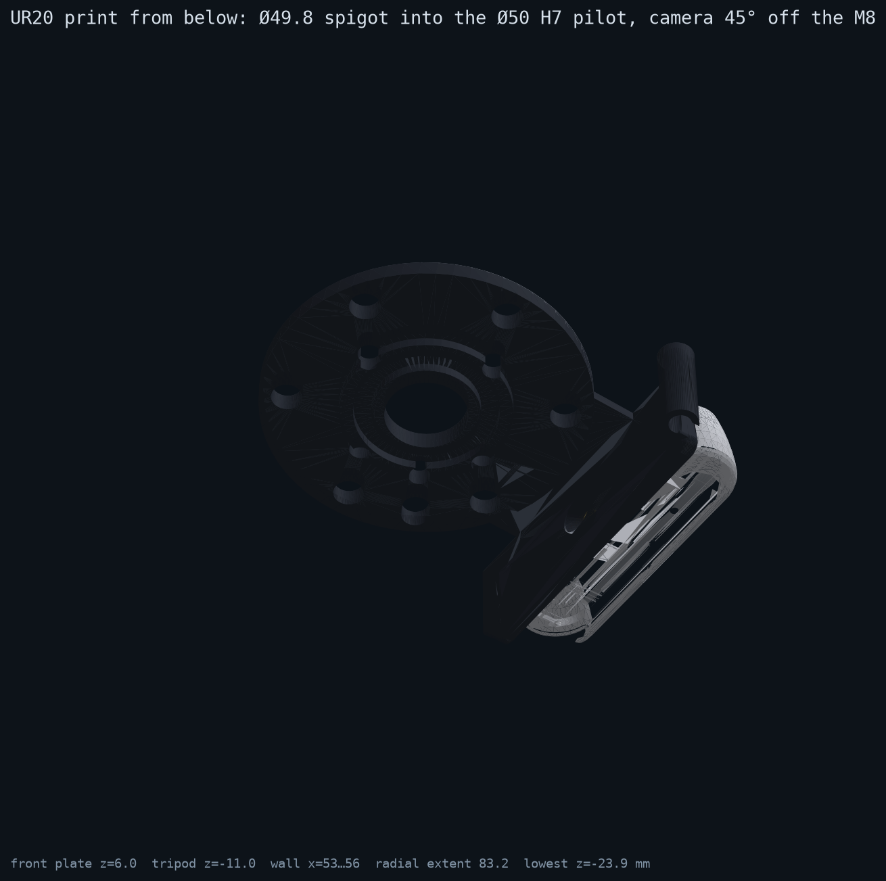
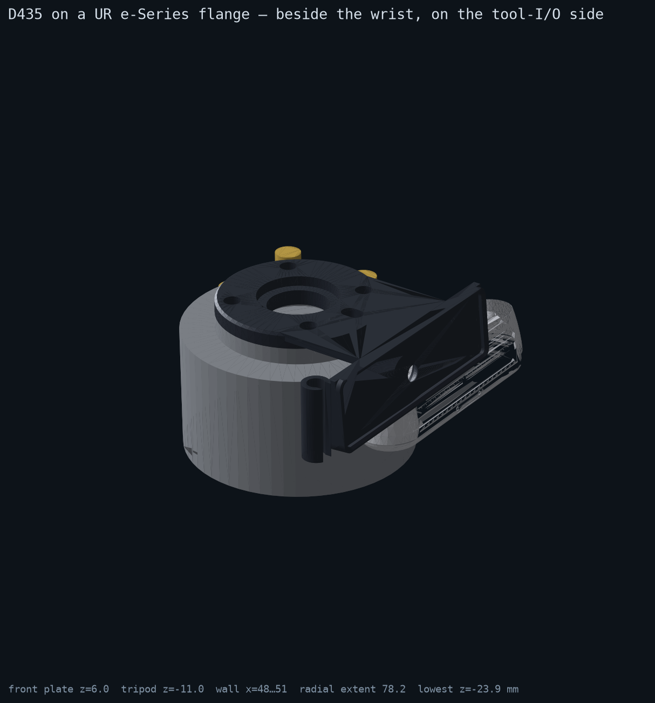
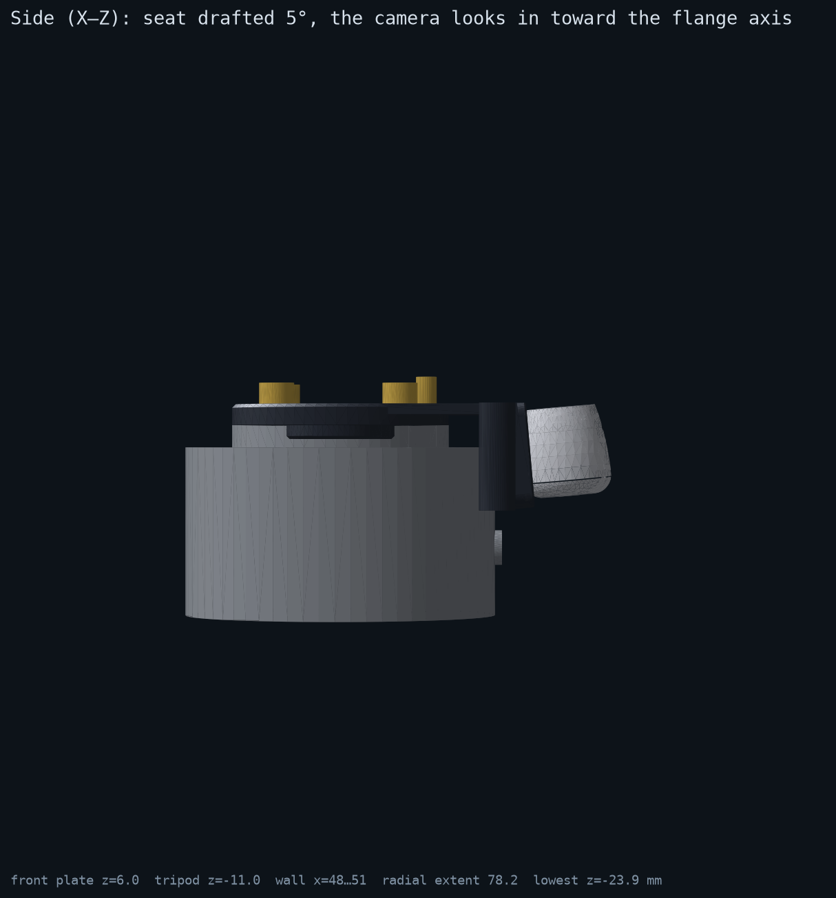
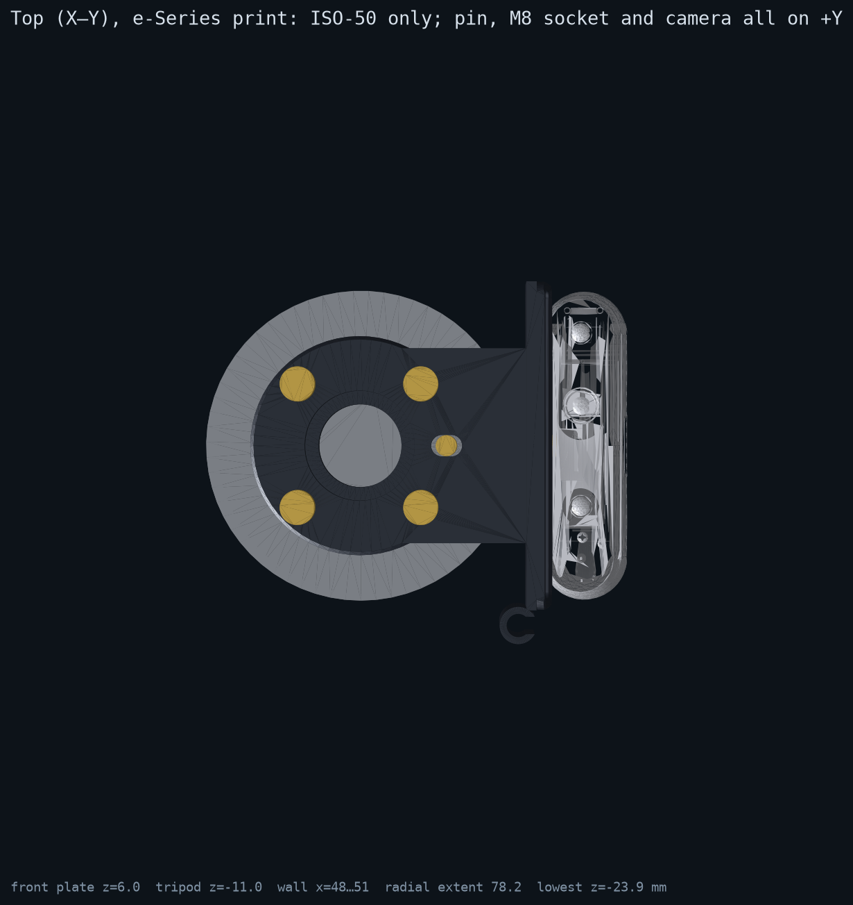
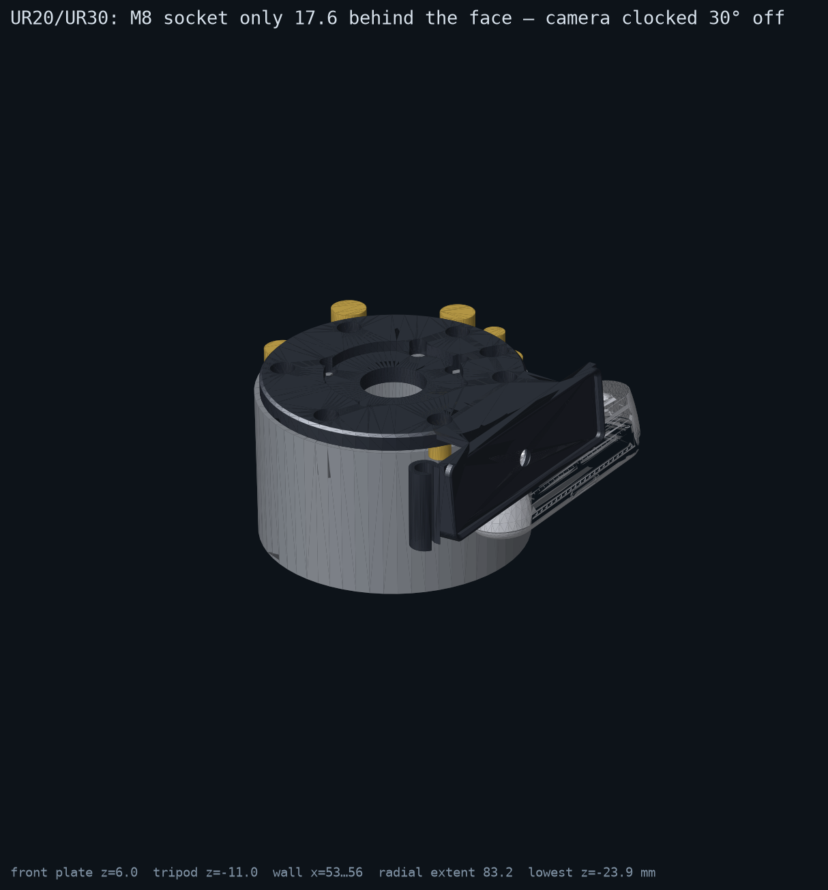
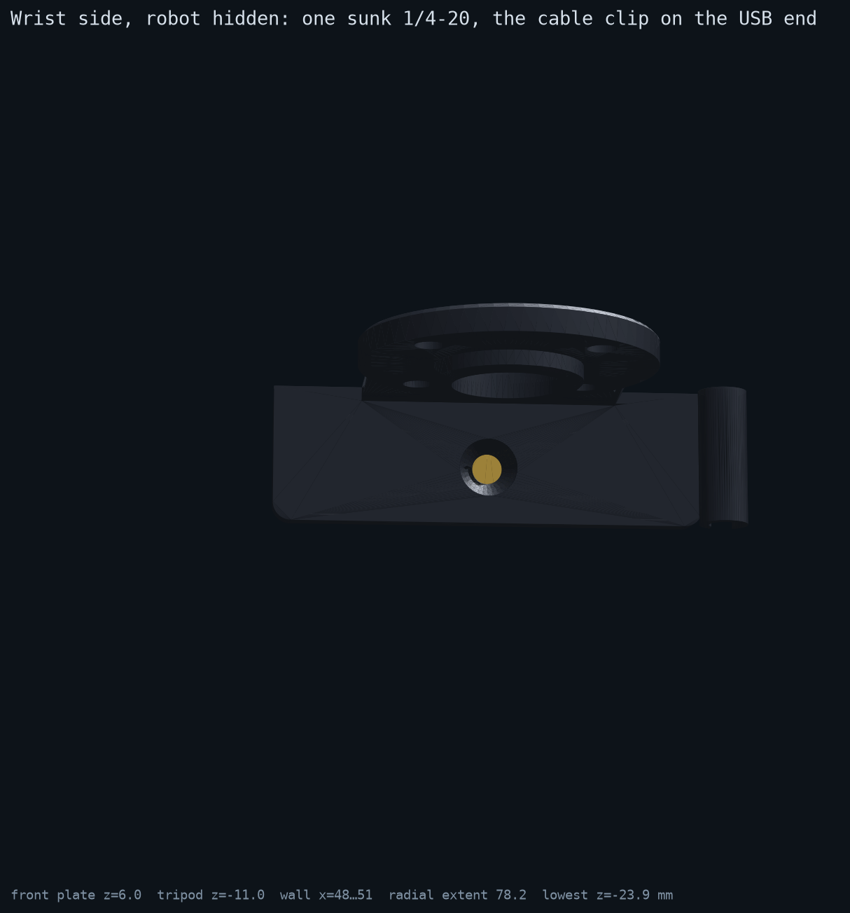

# D435 tool-flange adapter — specification / datasheet

**Part:** `d435_tool_bracket` · **Rev:** C (2026-10-02, Nick: one centre screw instead of three, a chamfered lip round the camera, the camera drafted 5° toward the centre, the wall half as thick, a cable clip for a USB cable leaving the right-hand end) · **Status:** Rev C designed, exported and clash-checked against Intel's body mesh, *not yet printed*. Rev B.2 is printed and runs on the UR3e (SETUP.md).
**Files:** `bracket.py` (parametric source, CadQuery) · **two prints**, `out/d435_tool_bracket_eseries.{stl,step}` and `out/d435_tool_bracket_ur20.{stl,step}` · `out/d435_tool_bracket_assembly_{eseries,ur20}.step` (flange + adapter + camera envelope + hardware) · `out/d435_body_in_flange_frame.stl` (Intel's D435 body, placed) · `renders/*.png`

A one-piece **sandwich adapter plate** for an Intel RealSense D435 on a Universal Robots tool flange, built as **two prints from one parametric file**: an ISO 9409-1-50-4-M6 print for the UR3e/5e/10e/16e (Ø63 disc, ISO-50 only) and an ISO 9409-1-80-6-M8 print for the UR20/UR30 (Ø96 disc, which also keeps the ISO-50 holes). The pattern holes are plain through holes, so the tool's own bolts pass through the plate into the robot. The camera **hangs beside the wrist, back along −Z**, in a **lipped seat on a 3 mm wall drafted 5°**, so its optical axis tips 5° in toward the flange axis; it leans about its outer front edge, which stays on the adapter's tool face, so nothing of the camera or the adapter rises into the tool's volume. **One 1/4-20 enters through the wall from the wrist side, sunk below the face**; the lip stops the camera turning on it. A **C clip** beside the camera's USB end takes the cable back along the wrist. Fit the camera to the adapter first, then bolt the adapter to the robot.

**What Rev C changed (Nick, 2026-10-02):**

| Ask | Rev B.2 | Rev C | Parameter(s) |
| --- | --- | --- | --- |
| Only a centre screw | 1/4-20 + 2× M3 | **1/4-20 only**, × 3/8" flat head, sunk 0.6 below the wrist face | `TRIPOD_*` (the `M3_*` are gone) |
| Chamfered lip round the perimeter | none | **2.5 high × 2 wide lip** round the camera's 90 × 25.05 footprint, 0.3 clear, 1 mm 45° lead-in on the inside edge, 0.5 on the outside | `LIP_H/W/CLEAR/CHAMFER/OUTER_CHAMFER/CORNER_R` |
| 5° draft, camera tilted toward the centre | optical axis on flange +Z | **5° toward the flange axis**: the seat is drafted, the wrist face stays vertical | `CAM_TILT_DEG` |
| Half the thickness | 6 mm wall, 6 mm tab | **3 mm wall** (at the top; the draft thickens it to 4.4 at the screw), **3 mm tab** | `WALL_T`, `TAB_T` |
| Cable management, USB off the right side | none | **snap-in C clip** for the 6.3 mm cable, on the right-hand end seen from the front | `CABLE_SIDE/D/CLIP_WALL/CLIP_GAP` |

**Not halved: the flange disc (6 mm).** It carries the Ø31.7 × 4 recess that re-presents the pilot to the tool over a 2 mm floor with the spigot ring under it; 3 mm cannot hold both. Keeping it also keeps the tool stack at +6 mm, so `PERCEPTRONICS_TIP_M` (0.163 = Hand-E 157 + 6) is unchanged. `PLATE_T=3` on the command line builds the thin disc if that trade is wanted.

**Two variants, one design.** The base parameters describe a Ø96 plate with both patterns and a wall that clears a Ø100 housing; each print applies a few overrides on top (`variant_params`, `VARIANTS` in `bracket.py`) — the geometry code is shared:

| Variant | Plate / patterns | Wall position | Camera clocking | Bottom spigot | Top recess |
| --- | --- | --- | --- | --- | --- |
| `eseries` (UR3e/5e/10e/16e) | **Ø63 × 6, ISO-50 only** (`ESERIES_PLATE_OD`, `ESERIES_PATTERNS`) | r = 48 … 51, 3 mm off the Ø90 wrist (`ESERIES_WRIST_R`); camera at r = 51.1 … 78.2 | `ARM_ANGLE_DEG = 90` — on the tool-I/O side | Ø31.3 × 4 into the Ø31.5 H7 recess | Ø31.7 × 4 for an ISO-50 tool's spigot |
| `ur20` (UR20/UR30) | Ø96 × 6, ISO-80 + ISO-50 | r = 53 … 56, 3 mm off the Ø100 housing; camera at r = 56.1 … 83.2 | `UR20_ARM_ANGLE_DEG = 30` — 60° off the M8 socket (§6.10; Rev B.2 was 45°) | **+ Ø49.8 × 3 ring into the Ø50 H7 pilot** (`UR20_SPIGOT_OD`) | **Ø50.2 × 4** for an ISO-80 tool's spigot (`UR20_TOP_RECESS_D`) |

Each variant is fully located on its own robot (pilot + pin + bolts) and re-presents that robot's ISO interface to the tool. The e-Series print dropped the ISO-80 pattern in Rev B.2 (Nick: optimise the e-Series); the UR20 print keeps the ISO-50 holes, which cost nothing on a Ø96 disc.

| | |
| --- | --- |
|  |  |

Rev A (2026-09-02) was a Ø63 plate with a 90° arm and the camera standing *above* the plate on +X; it read as looking sideways and would have fouled any tool. Rev B/B.2 hung the camera beside the wrist on three countersunk screws with its axis on +Z; Rev C is B.2 with the changes above.



| | |
| --- | --- |
|  |  |
|  |  |

The camera in the renders is Intel's own D435 body mesh (`vendor/`, see the NOTICE there), not a box. The build checks the same mesh against each print and refuses to export if any vertex of the camera is inside the bracket (`camera_clash_vertices` in `out/build_info.json`, 0 for both).

## 1. Requirements (what this part must do)

| ID | Requirement | How it is met | Verified |
| --- | --- | --- | --- |
| R1 | Mount on a UR e-Series ISO 9409-1-50-4-M6 flange **or** (second print) a UR20/UR30 ISO 9409-1-80-6-M8 flange | `eseries`: Ø63 × 6 plate, 4× Ø6.6 on Ø50 PCD (45°/135°/225°/315°), pin slot at 12 o'clock, Ø31.3 spigot into the Ø31.5 H7 recess. `ur20`: Ø96 × 6, + 6× Ø9 on Ø80 PCD (0°/60°/…/300°), Ø8 pin slot, Ø49.8 spigot into the Ø50 H7 pilot | dims from the UR10e and UR20 manuals (§2) |
| R2 | Camera optical axis **5° off flange +Z, tipped toward the flange axis** | the seat is drafted 5° (`CAM_TILT_DEG`); the camera leans about its outer front edge | `derived()["camera_axes_in_flange"]`, `side_xz.png` |
| R3 | Camera does not interfere with tooling | everything is at or below the tool face (z ≤ 6): the camera's outer front edge is on it, its inner front edge 2.2 below; the lip's front run is trimmed flush; camera, wall and clip only extend to −Z, beside the wrist (r ≥ 48 in the wall's arc, the clip past the camera's end) | `side_xz.png`, the trim in `build_bracket` |
| R4 | Camera can be fitted before the adapter goes on the robot | the 1/4-20 enters from the wrist-side face, sunk 0.6 below it; 3 mm clearance to the wrist (Ø90 e-Series / Ø100 UR20) | `wrist_side.png` |
| R5 | Tool still mounts normally | all pattern holes are through holes for the tool's own bolts (+8 mm); top recess Ø31.7 × 4 re-presents the Ø31.5 pilot to an ISO-50 tool; pin slots pass the pin through to the tool | — |
| R6 | Cable exit unobstructed and managed | the USB-C is on an end face (§6 A1); the cable drops off the plug into a snap-in C clip beside that end and runs back along −Z beside the wrist | §6 A1, `iso_closeup.png` |
| R7 | Printable in PPA-CF; simple enough for machining | Z-extrusions + one radial hole; the only overhangs are the 5° draft and the 2.5 mm back run of the lip (§5) | §5 |
| R8 | Others can iterate | every number is a named parameter in `bracket.py`; STL/STEP/renders regenerate from one command | this file |
| R9 | Camera on the tool-I/O side, clear of the M8 plug | `ARM_ANGLE_DEG = 90` puts the wall at 12 o'clock. e-Series socket is 35.65 behind the face and the wall ends 23.9 behind it: **5.8 mm axial clearance** to a Ø12 plug. The UR20's socket is only 17.6 behind its face, so the UR20 part is clocked to 30° (`UR20_ARM_ANGLE_DEG`, 6.4° angular clearance counting the clip on both ends) | `derived()["tool_connector"]` |
| R10 | Camera located by one screw | the lip surrounds the footprint with 0.3 mm per side, so the camera cannot turn about the 1/4-20 | clash check, §7 |

## 2. Interfaces (the numbers that are not ours)

### 2.1 UR e-Series tool flange (UR10e User Manual SW 5.19, §8.7.5 "Securing Tool")

| Feature | Value | Note |
| --- | --- | --- |
| Standard | ISO 9409-1-50-4-M6 | identical on UR3e/5e/10e/16e |
| Flange face | Ø63 h8, proud of the Ø90 wrist by 6.50 | the `eseries` plate matches it |
| Bolt circle | Ø50 ±0.1, 4× M6-6H, thread depth 8 | at 45° from the dowel, 4×90° |
| Dowel hole | Ø6 H7, depth 6.20 ±0.20, on the PCD at 12 o'clock | tool-I/O connector side |
| Centring recess | Ø31.50 H7 | depth not dimensioned; spigot kept to 4 mm |
| Bolt length | "do not use bolts that extend beyond 10 mm" into the flange | ⇒ ≤ 8 mm engagement |
| Tool-I/O socket | Lumberg RKMW 8-354 (M8, 8-pin) at 12 o'clock on the Ø90 wrist, **35.65 behind the face** | UR10e manual SW 5.21 §7.11.3 drawing |

### 2.2 UR20 / UR30 tool flange (UR20 User Manual SW 5.21, 718-818-00, §8.11.3 "Securing Tool")

| Feature | Value | Note |
| --- | --- | --- |
| Standard | ISO 9409-1-80-6-M8 | UR30 datasheet: same flange |
| Flange face | Ø100 h8; the Ø100 housing continues 56.50 behind the face | drives `WRIST_R = 50` |
| Bolt circle | Ø80 ±0.1, 6× M8-6H, thread depth 17.25 | 6×60°, first hole 30° from the pin ⇒ holes at 3 and 9 o'clock |
| Pin hole | Ø8 H7, depth 8 ±0.2, on the PCD at 12 o'clock | |
| Pilot | Ø50 H7 | engaged by the `ur20` variant's Ø49.8 × 3 ring (`UR20_SPIGOT_OD`); the e-Series print leaves it off |
| Bolt length | "do not use bolts that extend beyond 17.25 mm" | |
| Tool-I/O socket | M8 at 12 o'clock on the Ø100 housing, **centreline 17.60 behind the face** | section A-A; in the wall's path — see R9 |

### 2.3 Camera: Intel RealSense D435

| Feature | Value | Source |
| --- | --- | --- |
| Envelope | 90 × 25 × 25.05 mm (length × height × depth) | datasheet 337029-017 Fig. 10-9; mesh bbox agrees |
| Tripod thread | 1/4-20 UNC on the bottom, at the length centre, **14.9 mm behind the front plate** | Intel URDF `d435_cam_mount_from_center_offset`; mesh boss at 14.91 |
| M3 mounting points | 2×, on the bottom, 45 mm apart — **not used from Rev C** | mesh, datasheet |
| Depth origin | left imager, 17.5 mm to the camera's left of the tripod, at mid-height, 4.3 mm behind the front plate | Intel URDF (`0.0175`, `zero_depth_to_glass 4.2e-3` + `glass_to_front 0.1e-3`) |
| Front-plate order, camera-left → right | RGB (+32), left imager (+17.5), projector (−17.5), right imager (−32.5) | mesh window centres |
| Bottom flat | only 9 … 20.5 mm behind the front plate (front and back edges are rounded) | mesh |
| USB-C | **on an end face** on Nick's unit (2026-09-12); Intel's 2018 mesh has it on the back face at the camera-left end. Camera-left is the **right-hand end seen from the front**, which is where the clip goes (`CABLE_SIDE = "right"`) | mesh, Nick |
| Depth FOV (H×V) | 87° × 58°, RGB 69° × 42° | datasheet |
| Mass | 72 g | Intel spec page |

### 2.4 USB cable (`hardware/BOM.md` K4)

Newnex U3HLA01C12-030, high-flex USB 3 A to C with dual screw locks: **6.3 mm OD** (Newnex's USB 3 high-flex table). The clip's bore is 6.7 with a 5.0 snap opening (`CABLE_D`, `CABLE_CLIP_GAP`). A thinner cable needs `CABLE_D` set to its OD, or it rattles.

## 3. Geometry (all mm, from `bracket.py` PARAMS → `derived()`)

Frame: origin = centre of the flange face, +Z = away from the flange (tool direction), +Y = towards the pin holes and the tool-I/O socket. **The camera side is on +Y too** (`ARM_ANGLE_DEG = 90`; the geometry is authored on +X untilted, then leaned by `CAM_TILT_DEG` about the camera's outer front edge, then clocked — the plate features stay with the robot). **Positions below are the `eseries` print**; the `ur20` print's plate is Ø96 with the ISO-80 rows added and everything on the camera side 5 mm further out, at 30°.

| Item | Value | Parameter(s) |
| --- | --- | --- |
| Plate | **Ø63 × 6**, 1 mm chamfer on the tool-face edge (`ur20`: Ø96 × 6) | `ESERIES_PLATE_OD` / `PLATE_OD`, `PLATE_T`, `PLATE_EDGE_CHAMFER` |
| ISO-50 bolt holes | 4× Ø6.6 thru on Ø50 PCD at 45°/135°/225°/315° | `BOLT50_HOLE_D`, `PCD50`, `BOLT50_ANGLES_DEG` |
| ISO-50 dowel slot | 6.2 wide × 9 long, radial, thru, at +Y r = 25 | `DOWEL50_SLOT_W/L` |
| ISO-80 bolt holes (`ur20` only) | 6× Ø9 thru on Ø80 PCD at 0°/60°/120°/180°/240°/300° | `BOLT80_HOLE_D`, `PCD80`, `BOLT80_ANGLES_DEG`, `PATTERNS` |
| ISO-80 pin slot (`ur20` only) | 8.2 wide × 11 long, radial, thru, at +Y r = 40 | `DOWEL80_SLOT_W/L` |
| Spigot (bottom) | Ø31.3 × 4, ID 24, 0.8 chamfer (e-Series recess) | `SPIGOT_OD/H/CHAMFER` |
| UR20 spigot (`ur20` only) | Ø49.8 × 3 ring, 4 mm wall | `UR20_SPIGOT_OD`, `SPIGOT80_H` |
| Recess (top) | Ø31.7 × 4 (`eseries`) / Ø50.2 × 4 (`ur20`), 2 mm floor | `TOP_RECESS_D/H`, `UR20_TOP_RECESS_D` |
| Centre hole | Ø24 thru | `CENTER_HOLE_D` |
| Tab | Y = 11.5 … 49.5, X = ±28, **z = 3 … 6** (3 thick, flush with the tool face) | `ARM_W`, `TAB_T` |
| Wall | wrist face vertical at Y = **48**; seat face drafted 5°: 3.0 thick at the tool face, 4.4 along the screw axis; X = **±47.3** (the lip's outline, R4 bottom corners); z = **−23.9 … 6** | `ESERIES_WRIST_R` / `WRIST_R`, `WALL_CLEAR`, `WALL_T`, `CAM_TILT_DEG`, `LIP_CORNER_R` |
| Lip | round the 90.6 × 25.65 seat (camera + 0.3 a side), 2 wide, 2.5 proud of the seat, inner corners R2 / outer R4, 1.0 × 45° inside chamfer, 0.5 outside; the front run is trimmed at the tool face | `LIP_*` |
| 1/4-20 | Ø6.6 along the seat normal at X = 0, 14.9 behind the front plate (seat point z = **−11.0**); 82° countersink Ø12.7 on the wrist face, **sunk 0.6** (the face is vertical, the screw 5° off it — a flush mouth leaves one side of the head 0.55 proud); 0.3 mm cylindrical land left | `TRIPOD_HOLE_D`, `TRIPOD_CSK_D/ANGLE/SINK`, `TRIPOD_FROM_FRONT` |
| Cable clip | C ring, bore Ø6.7, 2 wall, 5.0 opening facing radially out, z = −23.9 … 6, centre (X, Y) = **(+51.7, +45.7)** — just past the camera's right-hand end (seen from the front), its outer edge on the seat line | `CABLE_SIDE`, `CABLE_D`, `CABLE_CLIP_WALL/GAP` |
| Camera envelope | Y = 51.1 … 78.2, X = ±45, z = −21.1 … **6.0** (outer front edge on the tool face, inner front edge at 3.8); `ur20`: r = 56.1 … 83.2 | `CAM_H/L/D`, `CAM_PROUD` |
| Radial extent / lowest point | 78.2 from the flange axis (`ur20`: 83.2) / z = −23.9 | `radial_extent`, `lowest_z` |
| Bracket bbox / volume / mass | `eseries`: 104 × 87 × 30 mm · **32.0 cm³** · 40 g solid PPA-CF (1.25 g/cm³); `ur20`: 124 × 119 × 30 · 48.7 cm³ · 61 g solid. Rev B.2 was 29.7 / 44.2 cm³: halving the wall saved less than the 95-wide lipped seat and the clip added (+8 % / +10 %) | `out/build_info.json` → `export.variants` |

**Nominal camera pose (hand-eye seed).** Camera axes in flange axes: `x_cam = −X`, `y_cam = (0, −cos 5°, −sin 5°)` (image-down points at the mounting wall), `z_cam = (0, −sin 5°, cos 5°)` — the optical axis leans 5° toward the flange axis; camera-left is +X. Depth origin (left imager) = **(17.5, 63.9, 0.6) mm** in the flange frame for the `eseries` print; the optical axis crosses the flange's axial plane ≈ 0.73 m out, and at 0.3 m it looks 26 mm nearer the axis than Rev B.2 did. (`ur20` print, 30° and 5 mm further out: (68.4, 19.3, 0.6) — `build_info.json` → `export.variants.ur20.derived`.) These are `perceptronics.handeye.BRACKET_SEEDS` (`PERCEPTRONICS_BRACKET=eseries|ur20` picks one; `tests/test_handeye.py` holds them to `build_info.json`); calibrate to finish — a printed part will not hold ±1°. A Rev B.2 print on a robot keeps its own calibration; as a seed for the orbit solve, the Rev C seed is 5° and 3 mm off it, well inside what the solve converges from.

## 4. Hardware (BOM)

| Qty | Item | Spec / note |
| --- | --- | --- |
| 4 or 6 | **The tool's own bolts, 8 mm longer** (M6 on e-Series, M8 on UR20/UR30) | the adapter has no bolts of its own; engagement limits are the flange's (≤ 8 mm e-Series, ≤ 17.25 mm UR20) |
| 1 | Dowel pin Ø6 m6 × 20 (e-Series) or Ø8 m6 × 24 (UR20) | through the slot, proud for the tool's pin hole |
| 1 | **1/4-20 UNC × 3/8" flat head, 82°** (stainless) | head top 3.8 below the seat → **≈ 5.7 mm into the camera** (the mesh shows a ≈ 8 mm bore; the D455 allows 9). Measure the thread depth with a pin before the first fit (§6 A4). Torque 1.5 N·m |
| — | Thread-locker (medium) on the flat head | plastic seats relax; re-torque after 24 h |

The sunk head is the point: the wrist-side face of the wall is 3 mm from the wrist (Ø90 e-Series, Ø100 UR20), so nothing may stand proud there. **Sequence: camera into the lip → 1/4-20 → adapter → robot → tool → cable into the clip.**

## 5. Material, printing, torque

- **Material:** PPA-CF (Bambu PPA-CF / Polymaker Fiberon PPA-CF). Dry the spool (≥ 8 h at 80–100 °C). Hardened 0.4 nozzle, ~300–320 °C, bed 80–100 °C, enclosure. Alternative: PA6-CF or PET-CF.
- **Orientation: tool face on the bed** (the chamfered face down, wall pointing up). The disc, tab, wall, lip ends and the clip are vertical extrusions from the bed; the seat face leans 5° out as it rises (an 85° wall, fine); the spigot ring points up; the top recess is a pocket in the first layers; the countersunk hole prints as a near-horizontal cone in the wall. The one real overhang is the lip's **back run**, a 2.5 mm ledge sticking out of the seat at the top of the print — short enough to print unsupported; its underside is inside the seat, where nobody sees it.
- **Walls/infill:** 4 perimeters, 30 % gyroid, 5 top/bottom layers, 0.2 mm layers. The 3 mm wall and tab and the 2 mm lip and clip are then all perimeters; only the 6 mm disc has infill. Expect ≈ 36 g of part and ≈ 40 g of filament for the e-Series print (**≈ $8–10** at $0.20–0.26/g for Bambu PPA-CF), ≈ 55 g / 60 g / $12–16 for the UR20 print — estimates from the volumes, not weighed. Don't go below 4 walls: the countersink needs the perimeters.
- **Fit tuning:** `SPIGOT_OD` (31.3) should slip into the Ø31.5 H7 recess by hand; `HOLE_PRINT_ALLOWANCE` adds to every hole if your printer undersizes (typical 0.1–0.2 with CF filaments). The camera should drop into the lip by hand: `LIP_CLEAR` (0.3 a side) is the knob if it binds. The cable should click into the clip and not slide under its own weight: `CABLE_CLIP_GAP` up if it needs force, `CABLE_D` down if it slides.
- **Torque (plastic joint):** tool bolts as the tool maker specifies (they clamp through the plate onto the flange — the plate is in compression only, 6 mm PPA-CF is fine). 1/4-20: 1.5 N·m.
- **Machining:** the same file mills from 6 mm aluminium plate + a bolted-on wall, or 5-axis from a block; the drafted seat and lip make Rev C a poorer fit for 3-axis than B.2 was.

## 6. Design considerations and assumptions

1. **A1 — USB-C and the clip.** Nick's unit has the USB-C on an *end* face (2026-09-12), not the back face Intel's 2018 mesh shows. The clip assumes it is the **right-hand end seen from the front** — the camera's own left, the end the mesh puts it on. If it is on the other end, `CABLE_SIDE=left` mirrors the clip. The plug leaves along ±X at the camera's mid-height (r ≈ 64); the cable bends down and in, clicks into the ring (past the camera's end, 69 from the flange axis, outside any wrist radius) and runs back along the wrist with the tool-I/O cable. The ring stops at the seat line, while the plug sits at the camera's mid-height, ~12 mm further out, so a screw-lock plug's overmold (K4) has room. **Check on the first fit:** the screw-lock housing's lowest edge against the 2.5 mm end lip — the lip is clear of a plug centred at mid-height unless the overmold reaches within 2.5 mm of the camera's bottom.
2. **A2 — spigot depth.** UR's drawing does not state the e-Series recess depth; ISO 9409-1 recesses are ≥ 6 mm on the 50 flange. The 4 mm spigot leaves margin. If the plate rocks, the spigot is bottoming: shorten `SPIGOT_H`.
3. **A3 — UR20 pilot depth.** The `ur20` print's Ø49.8 ring is 3 mm tall; the UR20 drawing shows the Ø50 H7 bore as a through bore, so it cannot bottom. Its fit (`UR20_SPIGOT_OD`) is the same 0.2 print allowance as the e-Series spigot — tune after the first print.
4. **A4 — 1/4-20 thread depth.** Intel's D435 drawing gives no max insertion for the 1/4-20 (the D455 says 9 mm); the mesh bore is ≈ 8 mm deep. The 3/8" flat head gives ≈ 5.7 mm — measure before the first fit; a 5/16" screw (≈ 4.1 mm) is the fallback if the bore is shallow.
5. **Field of view.** The tilt is about the camera's own x axis, so it moves the 58° vertical field: the edge on the flange-axis side now looks 34° off the tool axis instead of 29°, so more of the tool is in view near the lens. The adapter stays out of it: the lip's front run is 10 mm below the lens centre and ~6 mm in front of the zero-depth plane, ≈ 59° off axis. Mask in perception if a wide tool shadows the near field.
6. **Why one screw and a lip.** The two M3 (max 3 mm insertion, 0.4 N·m) only stopped the camera turning on the 1/4-20; the lip does that with no fasteners and makes the camera's position a property of the print, not of how the screws were snugged. The M3 holes in the camera stay empty.
7. **Why the pin slots are radial.** Each flange's pilot and pin hole both define position; a round pin hole in the tool over-constrains. UR says slot it radially (both manuals).
8. **Why the tilt pivots on the outer front edge.** Leaning about the bottom edge would lift the camera's outer front edge 2.2 mm above the tool face, into the tool's volume. Pivoting on the outer front edge keeps R3; the cost is that the inner front edge sits 2.2 below the face, which nothing minds.
9. **Stiffness.** A 3 mm PPA-CF wall 95 wide carrying 72 g on a ~12 mm lever is still far from any limit; the draft thickens it to 5 mm at the bottom, where it takes the screw's clamp. The wedge (vertical wrist face, drafted seat) keeps the 3 mm wrist clearance constant and puts the extra material where the countersink needs it.
10. **Tool-I/O side, and the UR20's clocking.** The Rev C wall is 95 wide (the lipped seat) and reaches 23.9 behind the face. On an e-Series the M8 socket is 35.65 behind the face, so a straight plug (Ø12) passes 5.8 mm below the wall (Rev B.2: 10.6). On a UR20/UR30 the socket is 17.6 behind the face — inside the wall's depth — so the wall must be clear of it in angle: ±47° of wall (counting the clip on both ends) + ±6.5° of plug needs ≥ 54° off the socket. `UR20_ARM_ANGLE_DEG = 30` gives 60°, 6.4° clear. Rev B.2's 45° no longer fits.
11. **Safety.** Adapter + camera ≈ 110 g (e-Series print) with the CoG ~50 mm off the flange axis and ~−5 mm along Z; add it to the UR payload/CoG (`Installation → Payload`) or the torque model drifts.

## 7. Verification checklist (fill in after the first print)

- [ ] `eseries`: spigot seats in the Ø31.5 recess without rocking; note the measured spigot OD and recess depth
- [ ] `ur20`: Ø49.8 ring enters the Ø50 H7 bore by hand; ISO-80 tool spigot enters the Ø50.2 top recess
- [ ] Ø6 pin passes the inner slot; Ø8 pin passes the outer slot; plate cannot rotate
- [ ] Tool bolts (+8 mm) enter freely through the plate; torque per the tool maker
- [ ] Camera drops into the lip by hand and cannot turn once the 1/4-20 is snug
- [ ] 1/4-20 engages ≤ the measured thread depth (depth gauge first)
- [ ] Flat head below the wrist-side face; wall clears the wrist through a full wrist-3 rotation
- [ ] USB-C on the right-hand end seen from the front (else `CABLE_SIDE=left`); the screw-lock plug seats without touching the lip (A1)
- [ ] Cable clicks into the clip and holds; no strain on the plug through a full wrist-3 rotation
- [ ] `perceptronics rs-info` sees the camera; `perceptronics gui` shows the tool where §6.5 predicts
- [ ] Hand-eye calibration result vs. the nominal (17.5, 63.9, 0.6) mm / axis map in §3 — expect the 5° tilt in the solve
- [ ] Tool-I/O plug seats with the wall in place (e-Series: 5.8 mm predicted clearance)
- [ ] Payload updated on the pendant

## 8. Regenerating

```bash
# cadquery is a design-time tool, not a runtime dependency of this repo:
#   python3 -m pip install cadquery matplotlib numpy     (+ fast-simplification for --refresh-camera-mesh)
python3 hardware/d435-tool-bracket/bracket.py            # defaults
python3 hardware/d435-tool-bracket/bracket.py CABLE_SIDE=left CAM_TILT_DEG=0 UR20_ARM_ANGLE_DEG=0
# re-derive the vendored Intel mesh from the pinned realsense-ros commit (network + fast-simplification)
python3 hardware/d435-tool-bracket/bracket.py --refresh-camera-mesh
```

Outputs land in `out/` (STL + STEP per variant, an assembly STEP per variant, the placed camera body STL, `build_info.json` with the per-variant overrides, derived numbers, the tool-connector clearance check and the camera clash count) and `renders/`. Any `UR20_*` / `ESERIES_*` parameter can be overridden on the command line like the rest (tuples as JSON, e.g. `ESERIES_PATTERNS='["iso50","iso80"]'` brings the dual plate back; strings bare, e.g. `CABLE_SIDE=none`). Changing anything that moves the camera changes the hand-eye seed: copy the new `depth_origin_flange_mm` / `camera_axes_in_flange` into `perceptronics/handeye.py` (`tests/test_handeye.py` fails until you do). Sources for every external number are cited in `bracket.py`'s docstring and `vendor/NOTICE.md`.
